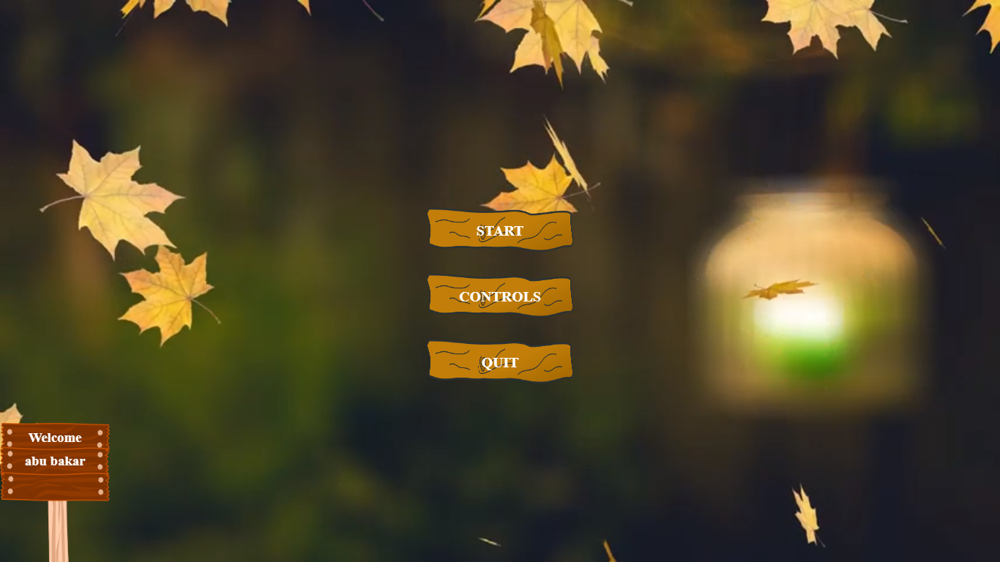
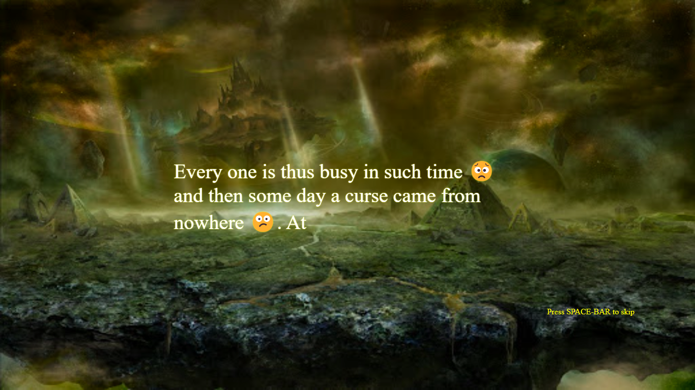
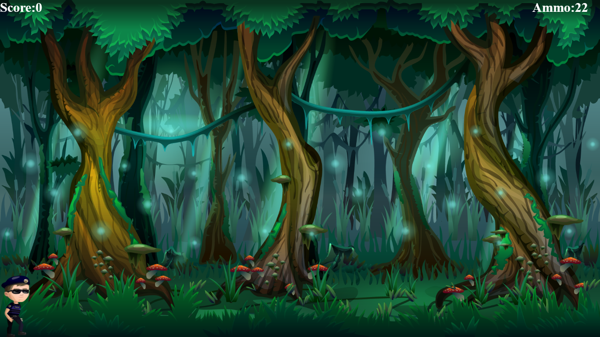
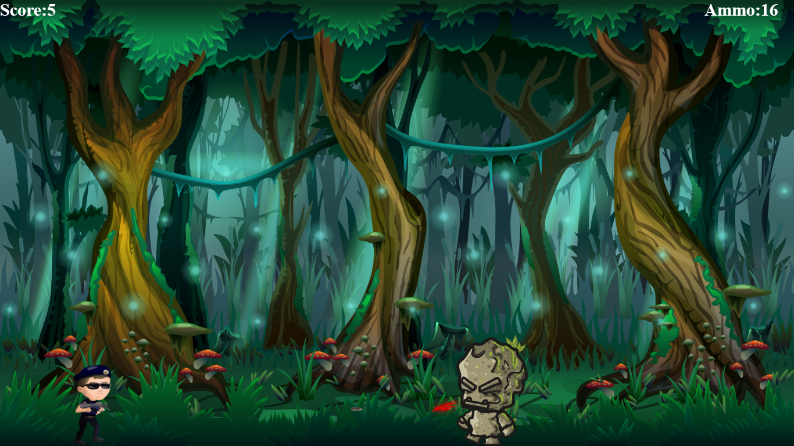
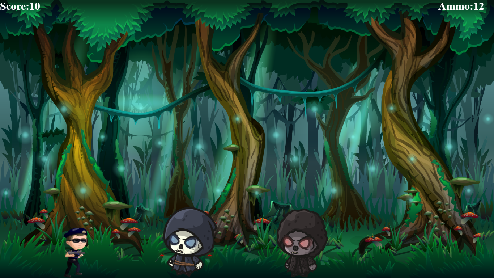
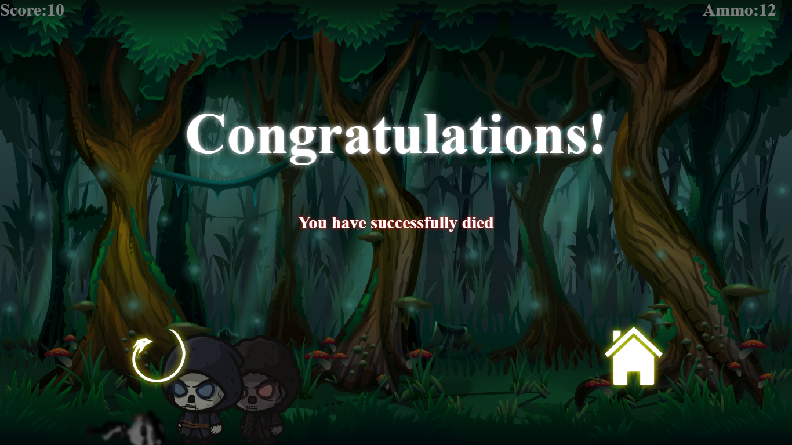

# 2D-noob-game
A game made to practice concepts of html, css and jquery 

### Background
🎮 Flashback to my coding journey: My first dive into web development in 2018 (or was it 2019? - time flies when you're coding!) led to creating a simple game using HTML, CSS, and JavaScript (with a dash of jQuery). 🚀 My very first project was born out of sheer curiosity and a desire to put my newfound skills to the test. It wasn't groundbreaking, but for a coding noob like me, the feeling of accomplishment was priceless! 💻 #CodingJourney #WebDev #GameDevelopment 🌟

### Video Link

### Screenshots

